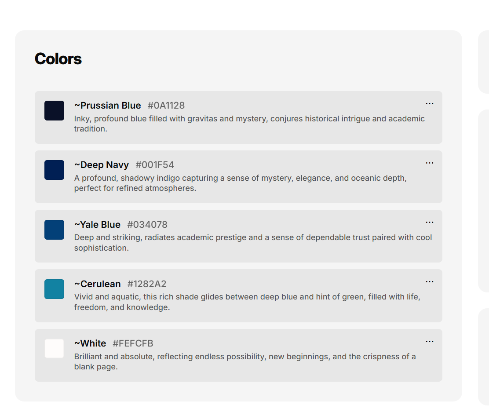
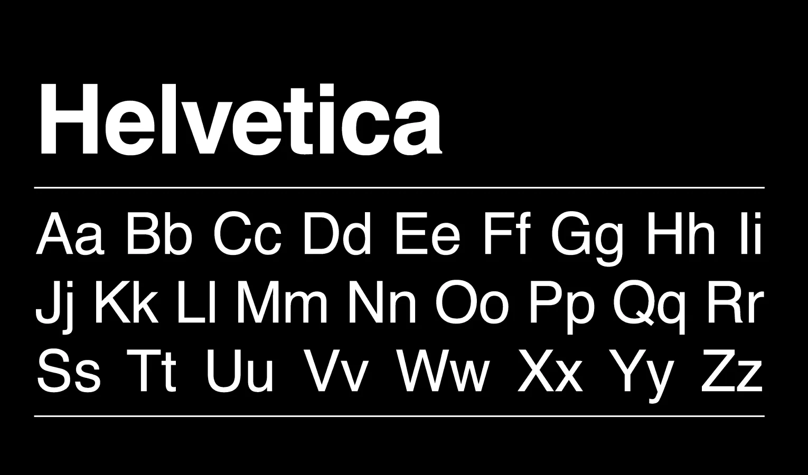
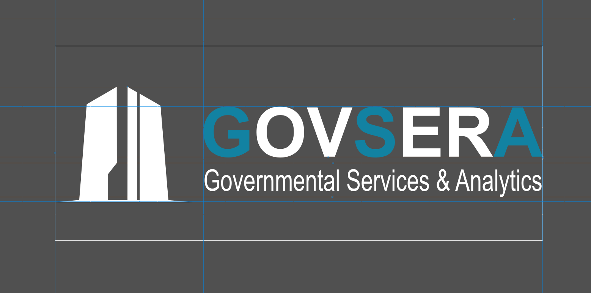
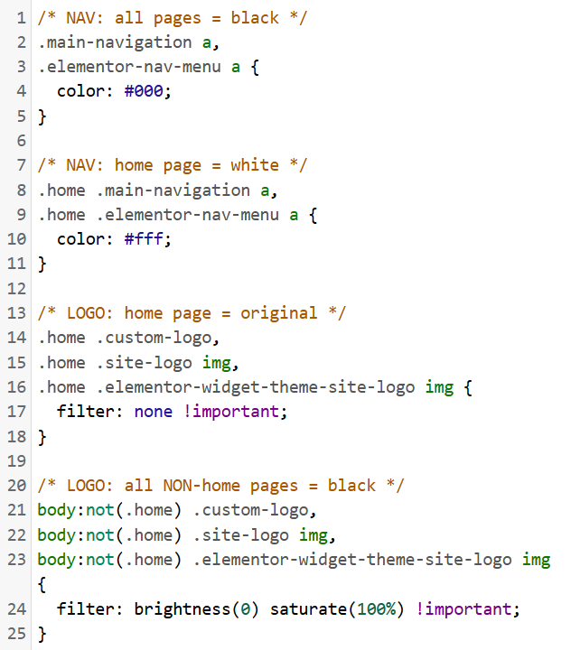

<h1>Visual Consistency & Branding (Page 5)</h1>

The homepage was reviewed for visual consistency across color, typography, logo usage, navigation styling, section design, and supporting digital assets. The goal was to create a cohesive brand presentation that felt clean, professional, and consistent across the website.

<h2>Color System</h2>

The visual identity used a controlled color palette:
<ul>
<li>#FEFCFB — light background color</li>
<li>#1282A2 — primary accent color</li>
<li>#034078 — secondary blue</li>
<li>#001F54 — deep navy</li>
<li>#0A1128 — dark base color</li>
</ul>

 

 

 
The blue tones supported a professional, government-facing visual style, while the light background helped keep the content readable and clean.
 
 
Blue was used because it commonly represents trust, stability, professionalism, and clarity. This aligned with the website’s government-facing financial services focus, where credibility and confidence are important.

<h2>Typography</h2>

Helvetica was used as the primary typeface. This supported a clean, modern, and professional appearance while keeping headings and body text easy to read.

 

 

<h2>Logo & Navigation</h2>

<h3>Logo Design</h3>

The logo was created to support a clean and professional brand identity across the website. Logo variations were prepared for different visual contexts, including light and dark backgrounds.
 

 

<h3>Navigation Styling</h3>

Custom CSS was used to control navigation color behavior across the site. The homepage used lighter navigation styling for contrast against the hero section, while internal pages used darker navigation styling for readability on lighter backgrounds.
 

 

> This helped maintain brand consistency while adapting the header design to different backgrounds.

<h2>Section Design</h2>

The homepage used repeated design patterns to create consistency across sections. This included structured content blocks, service cards, two-column layouts, consistent spacing, and clear background separation.

These patterns helped the page feel organized and made the content easier to scan from top to bottom.

<h2>Digital Asset Alignment</h2>

The website branding was aligned with supporting digital asset concepts, including logo usage, color consistency, typography, and professional presentation. This helped keep the brand identity consistent across web pages, visual materials, and business-facing communication.

 

[Return to Page 1 ](https://github.com/JorgeFSantillan/Front-End-Website-Development---Structured-UI-Implementation)
